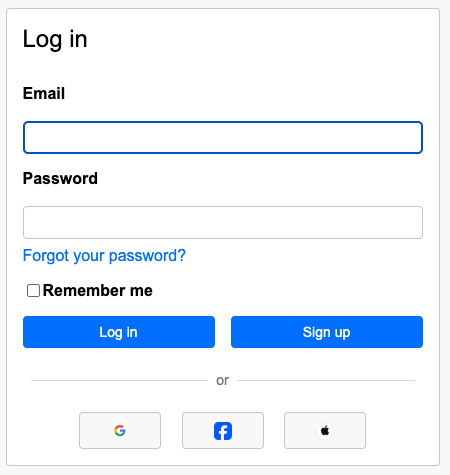

## Social Login Proof of Concept

This is a proof of concept app that taught me how to use Omniauth for social sign-ins. Development will plateau and stop as this will be merged into [Narratree](https://github.com/atshaw1994/Narratree).

## Screenshot



## Getting Started

To get this app running on your computer:

1. **Clone the repository:**

   ```sh
   git clone https://github.com/atshaw1994/social-login-POC.git
   cd social-login-POC
   ```

2. **Install dependencies:**

   ```sh
   bundle install
   ```

3. **Set up the database:**

   ```sh
   rails db:setup
   ```

4. **Set up environment variables:**

   - Copy `.env.example` to `.env` (if present) and fill in your Omniauth provider keys (Google, Facebook, Apple, etc.).
   - Or set the required environment variables in your shell/profile.

5. **Start the Rails server:**

   ```sh
   rails s
   ```

6. **Visit the app:**
   Open [http://localhost:3000](http://localhost:3000) in your browser.
